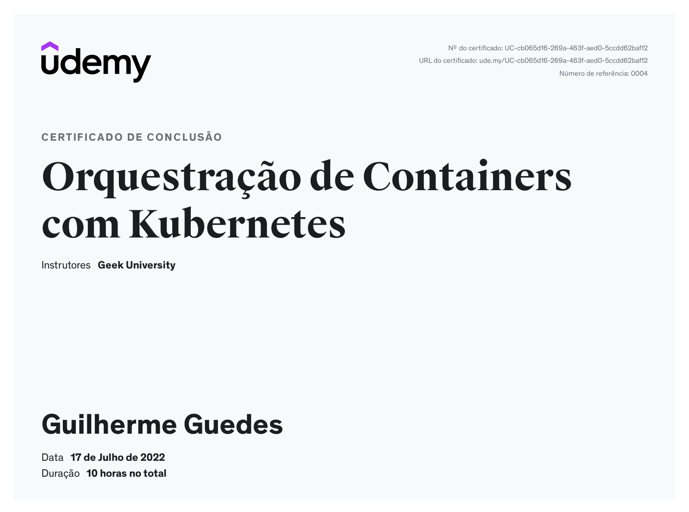

# curso-kubernetes
Atividades do curso de kubernetes da geek university

Download minikube:
https://minikube.sigs.k8s.io/docs/start/

Download kubectl:
https://kubernetes.io/docs/tasks/tools/install-kubectl-linux/

## Certificado de Conclusão do curso

