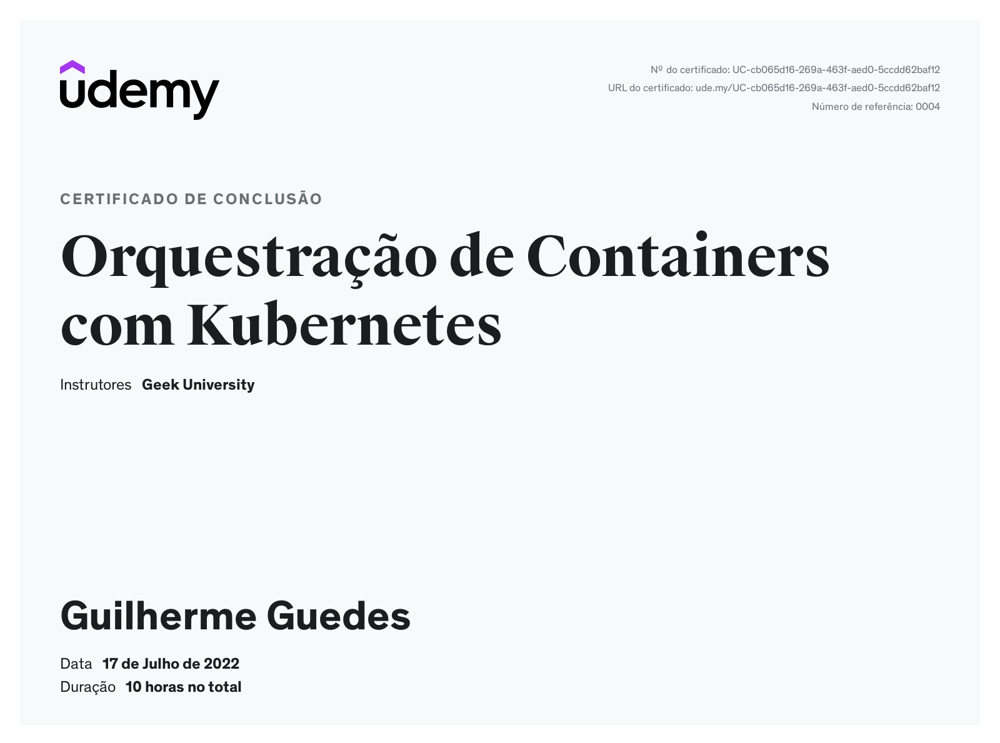

# curso-kubernetes
Atividades dos cursos de kubernetes

## Links Cursos
Udemy: https://www.udemy.com/course/orquestracao-de-containers-com-kubernetes/

Alura:
 - https://cursos.alura.com.br/course/kubernetes-pods-services-configmap

Download minikube:
https://minikube.sigs.k8s.io/docs/start/

Download kubectl:
https://kubernetes.io/docs/tasks/tools/install-kubectl-linux/

## Certificado de Conclusão do curso Udemy

